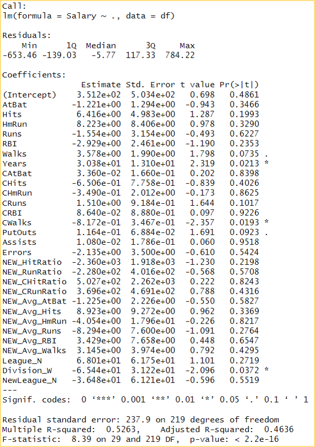
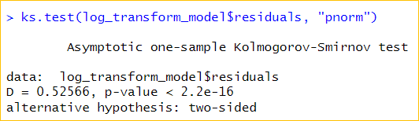

```{r setup, include=FALSE}
knitr::opts_chunk$set(echo = TRUE)
```

# **Çoklu Doğrusal Regresyon ile Maaş Tahmin Modeli**

{width="611"}

Maaş bilgileri ve **1986** yılına ait kariyer istatistikleri paylaşılan
beyzbol oyuncularının maaş tahminleri için bir doğrusal regresyon modeli
geliştireceğiz.

**Veri Seti Hikayesi**

Bu veri seti orijinal olarak Carnegie Mellon Üniversitesi'nde bulunan
StatLib kütüphanesinden alınmıştır.

Veri seti 1988 ASA Grafik Bölümü Poster Oturumu'nda kullanılan verilerin
bir parçasıdır.

Maaş verileri orijinal olarak Sports Illustrated, 20 Nisan 1987'den
alınmıştır.

1986 ve kariyer istatistikleri, Collier Books, Macmillan Publishing
Company, New York tarafından yayınlanan 1987 Beyzbol Ansiklopedisi
Güncellemesinden elde edilmiştir.

**Değişkenler**

***20 Değişken 322 Gözlem 21 KB***

-   AtBat 1986-1987 sezonunda bir beyzbol sopası ile topa yapılan vuruş
    sayısı

-   Hits 1986-1987 sezonundaki isabet sayısı

-   HmRun 1986-1987 sezonundaki en değerli vuruş sayısı

-   Runs 1986-1987 sezonunda takımına kazandırdığı sayı

-   RBI Bir vurucunun vuruş yaptıgında koşu yaptırdığı oyuncu sayısı

-   Walks Karşı oyuncuya yaptırılan hata sayısı

-   Years Oyuncunun major liginde oynama süresi (sene)

-   CAtBat Oyuncunun kariyeri boyunca topa vurma sayısı

-   CHits Oyuncunun kariyeri boyunca yaptığı isabetli vuruş sayısı

-   CHmRun Oyucunun kariyeri boyunca yaptığı en değerli sayısı

-   CRuns Oyuncunun kariyeri boyunca takımına kazandırdığı sayı

-   CRBI Oyuncunun kariyeri boyunca koşu yaptırdırdığı oyuncu sayısı

-   CWalks Oyuncun kariyeri boyunca karşı oyuncuya yaptırdığı hata
    sayısı

-   League Oyuncunun sezon sonuna kadar oynadığı ligi gösteren A ve N
    seviyelerine sahip bir faktör

-   Division 1986 sonunda oyuncunun oynadığı pozisyonu gösteren E ve W
    seviyelerine sahip bir faktör

-   PutOuts Oyun icinde takım arkadaşınla yardımlaşma

-   Assits 1986-1987 sezonunda oyuncunun yaptığı asist sayısı

-   Errors 1986-1987 sezonundaki oyuncunun hata sayısı

-   Salary Oyuncunun 1986-1987 sezonunda aldığı maaş(bin uzerinden)

-   NewLeague 1987 sezonunun başında oyuncunun ligini gösteren A ve N
    seviyelerine sahip bir faktör

**Verinin İçeri Aktarılması**

Verimizi ilgili klasörden içeri aktarıyor:

```         

df <- read.csv("C:\\Users\\GLB90057874\\Desktop\\Denetimli İstatistik\\hitters_eda.csv")
```

*Veriye ilk bakış:*

```         

head(df)
```

**Çoklu Doğrusal Regresyon Modelinin Tüm Değişkenler ile Kurulması: Base
Model**

Yüksek korelasyona sahip değişkenler hariç diğer değişkenleri ekleyerek
model kuruyoruz.

```         

base_model=lm(Salary~., data=df)
```

Özetine ve ilgili katsayılarına bakalım.

```         

summary(base_model)
```



Model istatistiksel olarak anlamlıdır. **(F-istatistiği = 8.39, p-değeri
\< 2.2e-16).**

R-kare değeri **0.5263'tür,** bu da modelin Salary değişkenindeki
varyasyonun **%52.63**'ünü açıkladığını gösterir. Düzeltilmiş R-kare
değeri **0.4636**'dır, bu da modeldeki bağımsız değişkenlerin sayısını
dikkate alır.

Modeldeki en önemli değişkenler **Years , NEW_HitRatio ve CWalks**'tır.
Artıklar yaklaşık olarak normal dağılmıştır.

Genel olarak, base_model verilere iyi bir uyum sağlar ve Salary
değişkenindeki varyasyonun önemli bir kısmını açıklar. Modeldeki en
önemli bağımsız değişkenler ise **Years, NEW_HitRatio ve CWalks'**tır.

*VIF değerlerini inceleyelim:*

```         

library(car)
vif(base_model) #VIF değerlerini yazdırır.
```

{width="692"}

***Yüksek VIF (10'dan büyük):***

AtBat, Hits, CAtBat, CHits, NEW_Avg_AtBat, NEW_Avg_Hits: Bu
değişkenlerin VIF değerleri nispeten yüksek, bu da bu değişkenler
arasında potansiyel çoklu doğrusallık sorunları olduğunu gösteriyor. Bu,
bu değişkenlerin birbirleriyle ilişkili olabileceği anlamına gelir ve
bağımlı değişken üzerindeki etkilerini izole etmeyi zorlaştırabilir.

***Orta Seviye VIF (5 ile 10 arası):***

HmRun, Runs, RBI, Years, CHmRun, CRuns, CRBI, CWalks, PutOuts, Assists,
NEW_HitRatio, NEW_RunRatio, NEW_CHitRatio, NEW_CRunRatio, NEW_Avg_HmRun,
NEW_Avg_Runs, NEW_Avg_RBI, NEW_Avg_Walks: Bu değişkenlerin VIF değerleri
orta seviyede. Tek başlarına sorunlu olmayabilirler, ancak diğer
değişkenlerle birlikte etkileşimleri çoklu doğrusallığa neden olabilir.

***Düşük VIF (5'ten küçük):***

Walks, Errors, League_N, Division_W, NewLeague_N: Bu değişkenlerin VIF
değerleri nispeten düşük, bu da onların çoklu doğrusallıktan daha az
etkilendiğini gösteriyor.

**WIF Değerlerine Göre Base_Model2'nin Kurulması**

Çoklu doğrusallıktan etkilenmemek adına ve daha iyi bir performans
modeli için farklı bir model kuruyoruz.

Bu modelde WIF değerleri baz alınarak yeni üretilen değişkenler
üzerinden kuracağız.

```         

base_model2=lm(Salary~Walks+PutOuts+Assists+Errors+NEW_HitRatio+NEW_RunRatio+NEW_CHitRatio+NEW_CRunRatio+League_N+Division_W+NewLeague_N, data=df)

summary(base_model2)

vif(base_model2)
```


{width="1005"}**Değişken Seçim Yöntemlerinin
Kullanılması ve Model Değerlendirme**

```         

library(olsrr)
library("ISLR")
library(car)

a=ols_step_all_possible(base_model2)
plot(a)
summary(a)
```

{width="944"}

Cp değerlerine göre **1024** nolo modelde **Walks PutOuts NEW_HitRatio
NEW_RunRatio NEW_CHitRatio Division_W N:6 CP:4.60** olarak çıkmıştır ve
modeli en iyi açıklayan baz değişkenlerin bu şekilde olduğunu
söyleyebiliriz.

```         

s=ols_step_both_p(base_model2)
s=ols_step_both_p(base_model2, pent = 0.05, prem = 0.1)
s
s$base_model2
plot(s)
```

Stepwise yöntemi ile de seçim yaptığımızda R2 ve
Düzeltimiş R2 değerleri özellikle 4 değişken içerisinde artış
gösterdiğini görüyoruz.

**Base_Model3 Oluşturulması ve Matrix Plot Çizimi**

```         

base_model3=lm(Salary~Walks+PutOuts+NEW_HitRatio+NEW_RunRatio+NEW_CHitRatio+Division_W, data=df)
summary(base_model3)
```

Base_model3 özetine baktığımızda R2'nin düşüş gösterdiğini görüyoruz.

```         

base_model3df <- data.frame(df$Walks, df$Salary, df$PutOuts,df$NEW_HitRatio,df$NEW_RunRatio,df$NEW_CHitRatio,df$Division_W)
pairs(base_model3df, pch=19, col='red', lower.panel = NULL)
```

{width="662"}

**Değişkenlerin Normalleştirilmesi için Dağılım Grafiklerinin Kontrolü**

```         

y_variable <- df$Walks
hist(my_variable, col = "skyblue", main = "Değişkenin Dağılımı", xlab = "Değerler", ylab = "Frekans") #log alacağız

my_variable <- df$PutOuts
hist(my_variable, col = "skyblue", main = "Değişkenin Dağılımı", xlab = "Değerler", ylab = "Frekans") #log alacağız

my_variable <- df$NEW_HitRatio
hist(my_variable, col = "skyblue", main = "Değişkenin Dağılımı", xlab = "Değerler", ylab = "Frekans") #log alacağız

my_variable <- df$NEW_RunRatio
hist(my_variable, col = "skyblue", main = "Değişkenin Dağılımı", xlab = "Değerler", ylab = "Frekans") #log alacağız

my_variable <- df$NEW_CHitRatio
hist(my_variable, col = "skyblue", main = "Değişkenin Dağılımı", xlab = "Değerler", ylab = "Frekans") #log alacağız
```

Değişkenler üzerinde istatiksel işlemler yapmadan önce dağılım
grafiklerinin kontrolünü sağlıyoruz. Sayısal değişkenler üzerinde log
dönüşümü yaparak modeli tekrar oluşturuyoruz.

```         

log_transform_vars <- c("Walks", "PutOuts", "NEW_HitRatio", "NEW_RunRatio", "NEW_CHitRatio")
df[log_transform_vars] <- log(df[log_transform_vars] + 1)  # +1 eklenmesi log(0) hatasını önler

log_transform_model <- lm(Salary ~ Walks + PutOuts + NEW_HitRatio + NEW_RunRatio + NEW_CHitRatio + Division_W, data = df)

summary(log_transform_model)
```

**Log Alınmış Model Matrix Plot Çizimi**

```         

log_transform_modeldf <- data.frame(df$Walks, df$Salary, df$PutOuts,df$NEW_HitRatio,df$NEW_RunRatio,df$NEW_CHitRatio,df$Division_W)
pairs(log_transform_modeldf, pch=19, col='red', lower.panel = NULL)
```

**Hataların Normal Dağıldığını Kontrol Etme**

```         

qqnorm(log_transform_model$residuals)
qqline(log_transform_model$residuals)
```

**Kolmogorov-Smirnov Testi**

```         

ks.test(log_transform_model$residuals, "pnorm")
```

{width="687"}

Bu test sonuçlarına göre, regresyon modelinizin hata terimleri normal
bir dağılıma uymamaktadır. p değeri çok düşük olduğu için, null hipotez
(veri setinin normal bir dağılıma sahip olduğu) reddedilir. Bu durumda,
modelinizin normalite varsayımı karşılamadığını söyleyebiliriz.

**Hataların Sabit Varyanslı Olup Olmadığını Kontrolü**

Hataların standartlaştırılmış (Studentized) değerlerini elde etmek için

```         

log_transform_model_stand_residuals <- rstandard(log_transform_model)
```

Hataların standartlaştırılmış değerlerini görselleştirmek için

```         

plot(log_transform_model_stand_residuals, ylab = "Standartlaştırılmış Hatalar", xlab = "Gözlemler")
abline(h = 0, col = "red", lty = 2)
```

Residual plot çizimi

```         

plot(log_transform_model, which = 1)
```

**Uç Değer ve Etkin Gözlem Kontrolü**

Cook's Distance hesaplanması:

```         

cooksd <- cooks.distance(log_transform_model)
```

Cook's Distance grafikle görselleştirme

```         

plot(cooksd, pch = "o", cex = 1, main = "Cook's Distance")
abline(h = 4/length(log_transform_model$residuals), col = "red", lty = 2)
```

Residuals vs. Leverage grafik

```         

par(mfrow = c(1, 1))
plot(log_transform_model, which = 5)
```

**VIF Değer Kontrolü**

```         

vif(log_transform_model)
```

**Final Model Katsayıları**

```         

summary(log_transform_model)
```

**Katsayıların %95'lik Güven Aralıklarını Elde Etmek**

Güven ve Tahmin Aralıkları

```         

confint(log_transform_model)
confint(log_transform_model,level=0.95)
```


**Yeni Bir Gözlem Değeri için %95'lik Güven Aralığını ve Kestirim
Aralığını Oluşturma**

Walks + PutOuts + NEW_HitRatio + NEW_RunRatio + NEW_CHitRatio +
Division_W

*Yeni gözlem değeri için 95% güven aralığı*

```         

new_observation <- data.frame(Walks = 0.99, 
                              PutOuts = 1.11, 
                              NEW_HitRatio = 0.20, 
                              NEW_RunRatio = 0.29, 
                              NEW_CHitRatio = 0.20, 
                              Division_W = 1)
predict_interval <- predict(log_transform_model, newdata = new_observation, interval = "confidence", level = 0.95)
```

```         

cat("95% Güven Aralığı:", predict_interval[1], "ile", predict_interval[2], "\n")
```

**95% Güven Aralığı: 715.3476 ile 615.5252**


*Yeni gözlem değeri için tahmin ve 95% kestirim aralığı*

```         

predict_interval <- predict(log_transform_model, newdata = new_observation, interval = "prediction", level = 0.95)
```

```         

cat("95% Kestirim Aralığı:", predict_interval[1], "ile", predict_interval[2], "\n")
```

**95% Kestirim Aralığı: 715.3476 ile 161.6556**

**Model'i Geliştirmek Üzere Görüş ve Öneriler**

-   Modeldeki yeni türetilen ve mevcut değişkenler gözden geçirebilir,
    analize düşük, korelasyonu yüksek değişkenler çıkarılabilir.

-   Değişkenlere uygulanan dönüşümleri gözden geçirebiliriz. Belki de
    farklı dönüşümler veya ölçeklemeler kullanarak modelin performansını
    artırabiliriz.

-   Bağımsız değişkenler arasındaki çoklu doğrusallığı kontrol ettikten
    sonra bu değişkenlerde dönüşümler ya da farklı ölçeklemeler ile
    kontrol sağlayabiliriz.

-   Veri setini genişletmeli, mümkünse daha çok gözlem değeri elde
    etmeliyiz.

-   Tüm değişkenler ile kurulan modelden sonrasında değişken seçimi
    yapmalı ve sonrasında değişimler ve dönüşümler uygulamalıyız.
